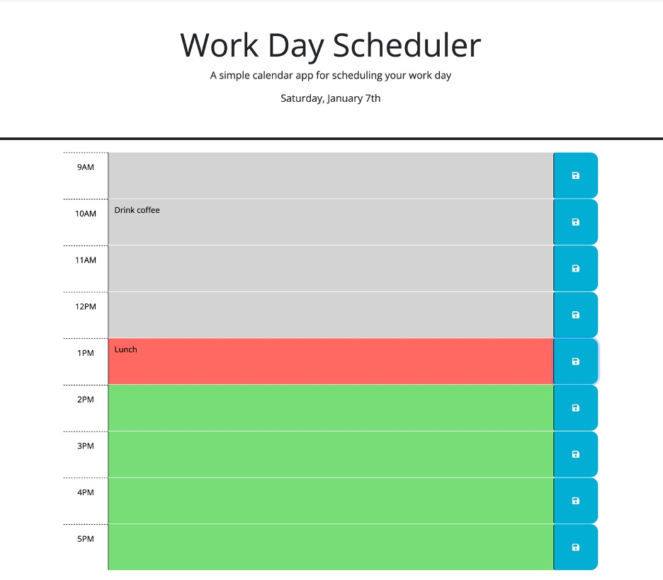

# Work-Day Scheduler

## Technology Used 

| Technology Used         | Resource URL           | 
| ------------- |:-------------:| 
| HTML    | [https://developer.mozilla.org/en-US/docs/Web/HTML](https://developer.mozilla.org/en-US/docs/Web/HTML) | 
| JavaScript     | [https://developer.mozilla.org/en-US/docs/Web/JavaScript](https://developer.mozilla.org/en-US/docs/Web/JavaScript)      |   
| jQuery | [https://jquery.com/](https://jquery.com/)     |  
| Day.js | [https://day.js.org/](https://day.js.org/) |  

 

## Description 

[Visit the Deployed Site](https://rmoscoe.github.io/work-day-scheduler)

This project is a schedule page for the current date. The user can save events to each time block of the workday, and these events persist when the page reloads. The current date populates automatically, and each time-block is automatically color-coded based on the current time at refresh. The site's functionality was built with jQuery, and the date/time functionality was accomplished with Day.js.

 

## Usage 

To add an event, click the time block in which you want to schedule the event. Type a description of the event, then click the save button for that time block to save the event.

 

## Learning Points 

This project gave me an opportunity to learn to use two common JavaScript libraries: **jQuery** and **Day.js**.

 

## Author Info

### Ryan Moscoe 

* [Portfolio](https://rmoscoe.github.io/portfolio/)
* [LinkedIn](https://www.linkedin.com/in/ryan-moscoe-8652973/)
* [Github](https://github.com/rmoscoe)
 

## License

See repository for license information.